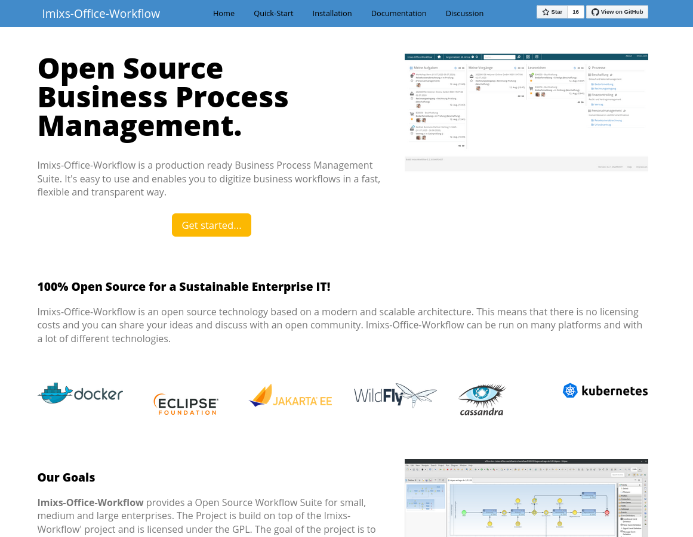

# Imixs Office Workflow - Maven Skin

This project provides a custom [maven-site skin](https://maven.apache.org/plugins/maven-site-plugin/) used by the project [Imixs-Office-Workflow](https://github.com/imixs/imixs-office-workflow). You can use and customize this Maven skin for your own project. 

The skin provides an easy, modern single-page responsive layout which can be adapted for different needs. 

## Usage

You will find the example front-page at `/src/main/resources/index.html`. The layout is defined by the CSS file `/src/maven/resources/css/main.css`.

The page `/src/test/resources/maven-demo.html` demonstrates  how a page generated by the Maven-Site Plugin will look like. The CSS file `/src/maven/resources/css/maven-base.css` defines some additional settings and overwrite some behavior of the main.css to display maven content in the right way. Normally it is not necessary to overwrite this CSS file. 

Before you can use this style for your own project, checkout this project and build the Maven Site Artefact with:

	$ mvn clean install

Now you can use the skin:

	<build>
	    <plugins>
	        ...
	        <plugin>
	            <groupId>org.apache.maven.plugins</groupId>
	            <artifactId>maven-site-plugin</artifactId>
	            <version>3.9.0</version>
	        </plugin>
	....
	<reporting>
	    <plugins>
	        <!-- java doc -->
	        <plugin>
	            <groupId>org.apache.maven.plugins</groupId>
	            <artifactId>maven-javadoc-plugin</artifactId>
	            <version>3.2.0</version>
	            <configuration>
	                <additionalOptions>-Xdoclint:none</additionalOptions>
	            </configuration>
	        </plugin>
	        <plugin>
	            <groupId>org.apache.maven.plugins</groupId>
	            <artifactId>maven-jxr-plugin</artifactId>
	            <version>3.0.0</version>
	        </plugin>
	    </plugins>
	</reporting>
	...
		
Than create a site.xml in your /src folder with at least the following entry:

	<?xml version="1.0" encoding="ISO-8859-1"?>
	<project name="Imixs Open Source Workflow">
	
	    <skin>
	        <groupId>org.imixs.workflow</groupId>
	        <artifactId>imixs-workflow-skin</artifactId>
	        <version>1.0.0</version>
	    </skin>
	    .....

To build your site run:

	$ mvn clean site
	
	    